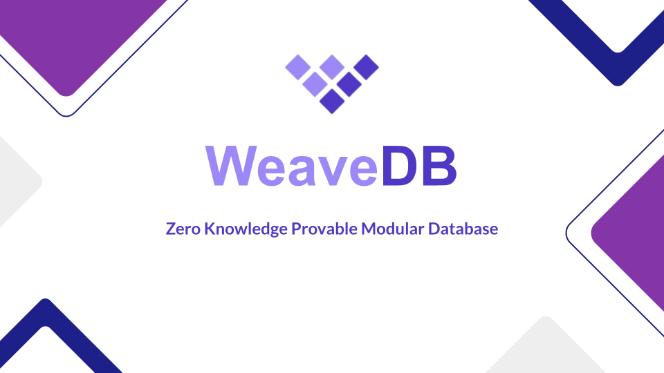

# WeaveDB - ZK Provable Modular Database

WeaveDB is the first decentralized, general-purpose modular database protocol that delivers:

- **Full mathematical provability**
- **Succinct ZK verifiability**
- **Cloud-grade throughput and latency**
- **Multi-paradigm support with modular architecture** (NoSQL, Relational, Vector)
- **Bit-level-optimized encoding** for maximum cost efficiency
- **Permanent storage** that enables provable data and compute provenance
- **Indefinite vertical and horizontal scalability**
- **Economically self-sustaining operations** through DePIN restaking
- **Autonomy and self-sovereignty** via onchain AI agents

- [Liepaper](https://docs.weavedb.dev/litepaper)
