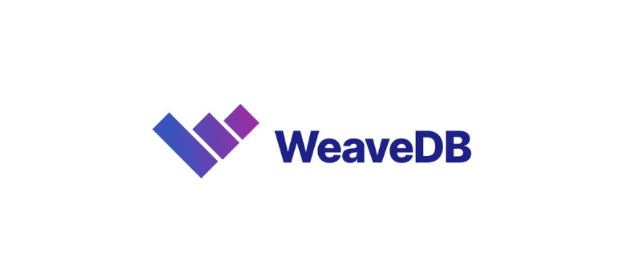

# WeaveDB

## About This Repo

[WeaveDB](https://github.com/weavedb/weavedb) is a monorepo that contains

- [Contracts](/contracts)
- [Tests](/test)
- [SDK for Web](/sdk/sdk-web)
- [SDK for NodeJS](/sdk/sdk-node)
- [Web Light Client](/sdk/light-client-web)
- [Node Light Client](/sdk/light-client-node)
- [gRPC Node](/grpc-node)
- [REPL](/scripts/runNode.js)
- [Web Console](/console)
- [Docs](/docs)
- [Example Dapps](/examples)
- [Index Engine](/index-engine)

You can view the docs at [docs.weavedb.dev](https://docs.weavedb.dev).

## What is WeaveDB?

WeaveDB is a NoSQL database powered by [Warp Contracts](https://warp.cc/) (SmartWeave) on the [Arweave](https://www.arweave.org/) blockchain.

The query APIs are similar to [Firestore](https://firebase.google.com/docs/firestore) from Google but completely decentralized.

#### Web3 Dapps with Web2 UX

Smart contract transactions are auto-signed, free and instant for dapp users, which enables web2 like smooth UX for fully decentralized web3 dapps.

#### Crypto Authentication

WeaveDB is permissionless with granular access controls with pure cryptography. Anyone can access with a one-time Metamask signature.

#### Powerful Logic for Complex Dapps

WeaveDB allows JSON-based functional programming on data, which opens up possibilities for building highly complex dapps with ease.

## Contract Versions

The latest contract can be found [here](https://docs.weavedb.dev/docs/sdk/version).

## Demo Dapps

Domo dapps and tutorials can be found [here](https://docs.weavedb.dev/docs/category/example-dapps).

*WeaveDB is still in its infancy. Everything is subject to change.*

