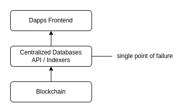
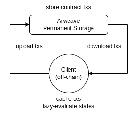
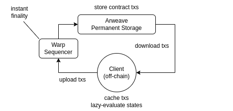
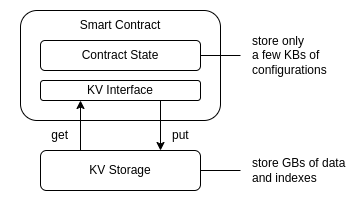
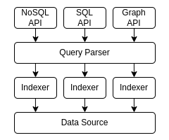

# WeaveDB Litepaper v0.1

```
 __          __                  _____  ____    _      _ _                                   
 \ \        / /                 |  __ \|  _ \  | |    (_) |                                  
  \ \  /\  / /__  __ ___   _____| |  | | |_) | | |     _| |_ ___ _ __   __ _ _ __   ___ _ __ 
   \ \/  \/ / _ \/ _` \ \ / / _ \ |  | |  _ <  | |    | | __/ _ \ '_ \ / _` | '_ \ / _ \ '__|
    \  /\  /  __/ (_| |\ V /  __/ |__| | |_) | | |____| | ||  __/ |_) | (_| | |_) |  __/ |   
     \/  \/ \___|\__,_| \_/ \___|_____/|____/  |______|_|\__\___| .__/ \__,_| .__/ \___|_|   
                                                                | |         | |              
                                                                |_|         |_|              
```

## Decentralized NoSQL Database as a Smart Contract

Blockchains are revolutionizing fintech with censorship-resistant and unstoppable networks with decentralization. But so far, their primary use cases are token transfers and their scalability is not even enough for mass financial adoption. However, the internet and the web are composed of data and web3 is an antithesis to centralized data silos beyond financial sectors. Blockchains, as of today, can never scale to the web level.

Many have attempted to build a decentralized social network but failed to build fully decentralized ones. This is primarily due to the fact that a practical alternative to web2 cloud databases has not been possible by now. There have been many decentralized database projects, but all of them are domain-specific, such as blockchain indexers, p2p graph DBs, and zkp-based privacy DBs, and not a general-purpose database to replace web2 databases. As a result, most web3 social networks call themselves sufficiently decentralized and use centralized servers and databases for data indexing and complex service logic and APIs.

This is obviously a huge issue for decentralized applications because if you lose the centralized database, the services relying on the APIs for data extraction will cease their operations. And as long as a centralized entity is managing the database layer, it's bound to stop sooner or later. The database layer is what cpsts the most when running a scalable service and the dev team cannot keep paying for the infrastructure forever. There have been many such examples where the provider arbitrarily changes the API pricing or stops APIs altogether and closes down the service itself.

<div align="center"></div>

You could build a fully decentralized application without a centralized database, but then all the logic has to run on smart contracts, and it would be super feature-limited without effective data indexing.

WeaveDB aims to solve these issues by building a fully decentralized database with the performance and scalability of web2 cloud databases.

### 4 Bottlenecks

A general-purpose fully decentralized database has not been realized so far due to 4 big bottlenecks.

- **Cost**  
Blockchain computation and storage are prohibitively expensive, including L2 rollups. Ethereum requires $10M to store 1GB of data.

- **Performance**  
Blockchain finality is slow, ranging from 500ms to 10 mins. But a practical DB requires less than 1ms finality with 10,000 -  100,000 TPS.

- **Scalability**  
Storage size is bottlenecked by the prohibitive cost. As of 2024, the total Ethereum storage size is just around 1TB. More than 300M TB of data is created every day on the web and it's accelerating.

- **Access Control**  
Unlike web2 databases with admins, decentralized databases are permissionless, and anyone can write anything from anywhere by default. Precise access control is required, but if we should go beyond simple data ownership, it requires highly flexible logic with complex implementations, and no database projects have figured it out.

So, building a practical decentralized database as a smart contract seems impossible, but in this paper, we would like to present a solution with the Arweave permanent storage.

### Why Smart Contract Database?

Before getting into the solution, I'd like to put an emphasis on smart contract database. You could build a decentralized database using existing technology and decentralize the network of nodes running the database. However, this approach limits the usability of the database to a great extent since the core components of web3 databases and web2 databases should be totally different. Instead, we build a brand new database from scratch, all as smart contract components, which unlocks the key features within the context of decentralized networks.

- **Verifiability of Computations and States**  
All the access logic and computation for data manipulations should be recorded on-chain and verifiable by anyone. Only smart contracts and their storage-based states can enable such public verifiability.
- **Composability with Other Smart Contracts**  
Smart contracts are building blocks of decentralized applications and composable with other smart contracts. WeaveDB can be a part of other smart contract protocols, such as DeFi, SocialFi, NFT, DAO, blockchain games, etc.
- **Interoperability with Other Blockchains**  
Once it's a smart contract protocol and managed by a decentralized network, it will open up interoperability with other blockchains. We implement 3 types of interoperability, explained in detail in the later sections.
  - Zero Knowledge Proof (ZKP)
  - Inter-Blockchain Communication (IBC)
  - Threshold Signature Scheme (TSS)

All these features will be unlocked with the blockchain standard protocols only if the database itself is a smart contract on a blockchain.

We define smart contracts as an immutable script verifiable by anyone on a blockchain with decentralized networks. In this sense, Solidity on EVM is not the only smart contract implementation; smart contracts can be written in any language on any VM.

## How Do We Solve This Problem

### Arweave Storage-based Consensus Paradigm (Cost)

Areave is a blockchain-like protocol (Blockweave) specializing in permanent storage. You need to pay a small one-time fee when uploading, and your data will be stored virtually forever (at least 200 years in the most pessimistic estimation). It costs [around $5 per GB](https://ar-fees.arweave.dev/), which is 400 tausand times cheaper than Ethereum, and it even gets cheaper as the storage hardware cost decreases every year.

There is a novel way to build a smart contract layer on permanent storage, and this methodology is called [Storage-based Consensus Paradigm (SCP)](https://medium.com/@perma_dao/storage-consensus-paradigm-non-blockchain-for-the-next-generation-of-blockchain-f635980c6510). SCP is an idea to use the storage consensus with off-chain computation to drastically lower the cost of the smart contract layer. In essence, all the data required for smart contract evaluations are stored permanently on Arweave, and state evaluations can be lazy-executed on the client side and off-chain, which costs nothing. So it's a combination of cheap permanent storage and free off-chain computations that enable the smart contract layer. It's called [SmartWeave](https://github.com/ArweaveTeam/SmartWeave).

<div align="center"></div>

### Warp SmartWeave Sequencer (Performance)

Arweave does not adopt absolute finality, so the safe block time is something around 20 minutes. This, of course, is too slow for a smart contract execution layer, so Warp took it further with an efficient sequencer to immediately order and finalize transactions without any evaluation. It bundles up smart contract transactions and uploads to Arweave via bundle protocols such as Irys and ArIO. This decreases time to finality (TTF) to just 10ms.

As mentioned earlier, [the Warp sequencer](https://warp.cc/) doesn't evaluate the contract states and it's a lazy evaluation on the client side, which enables even faster performance and lower latency than web2 cloud databases. This, however, opens up a different set of issues that led us to the WeaveDB Rollup development, addressed at the end of this paper.

<div align="center"></div>

### KV Storage Adaptors (Scalability)

The entire database is implemented as a smart contract, but storing all the data as a smart contract state is not scalable and portable at all. Every time the database needs to evaluate something, it needs to load the entire database to memory, which is impossible if you have, for instance,  100 million datasets.

Warp SmartWeave, fortunately, has implemented a protocol to enable underlying [KV storage with only interface (get/put/del)](https://docs.warp.cc/docs/sdk/advanced/kv-storage). This works as a KVS adaptor, and how you store the data via the KV interface is up to the node implementation. A node can use any existing database technology to deterministically store data  via the interface, and how much the database can scale will be up to the KV implementation of the node, and not up to the smart contract constraints. This is more future-proof since the hardware and database technology will improve in the future. In this way, we make the database indefinitely scalable. This is equivalent to Ethereum client diversity.

WeaveDB only stores minimum database configurations as the contract state. The actual data and indexes are stored in the underlying KV storage set up by the node in the way the node adaptor script defines.

<div align="center"></div>

Besides this, the Arweave network itself is supposed to be indefinitely scalable. The upper bound is only constrained by the storage cost. So, if a database needs to store a huge amount of data, in theory, someone just has to pay for it. Then, how to handle the data via the smart contract KVS interface is up to the node KVS.

### FPJSON (Access Control)

Simple data ownership logic can be implemented with the simple signature verification flow, but that's not how web2 databases work. Web2 database is indeed a combination of application logic on the server/client side and data access rules set to the database. Since you cannot control where users access the database from, to fully cover such web2 use cases, a web3 database should contain highly advanced application logic on the database side as well as advanced access control rules. In other words, data ownership should be programmable within the database logic. How do we achieve all these with an immutable smart contract?

The answer is [FPJSON](https://fpjson.weavedb.dev/), a domain-specific language (DSL) we developed to enable functional programming in the form of JSON arrays. FPJSON comes with more than 250 composable functions and you can express any level of advanced logic as a JSON array.

```javascript
["add", 1, 2] // = 3
["difference", [1, 2, 3], [3, 4, 5]] = [1, 2]
[["map", ["inc"]], [1, 2, 3]] // = [4, 5, 6]
[["compose", ["map", ["inc"]], ["difference"]], [1, 2, 3], [3, 4, 5]] // = [2, 3]
```

FPJSON plays a pivotal role in a smart contract database because any logic can be stored as a contract state and reused without deploying a new contract to extend database functionalities. Without FPJSON, one would have to deploy a new smart contract every time to update access control rules to the database.

Here's an example of how complex access control rules are defined with FPJSON.

```javascript
[
  // define a query type to follow a user ($signer=$from follows $to)
  "set:follow",
  [
    // split the document id (ids are in "from:to" format)
    ["split()", [":", "$id", ["=$from", "=$to"]]],
	
	// check if the signer is the from (signer is verified with signature) 
    ["=$isFromSigner", ["equals", "$from", "$signer"]],
	
	// modify the uploaded data to add who follows whom with the query timestamp
    ["mod()", { from: "$from", to: "$to", date: "$ms" }],
	
	// accept the query only if $isFromSigner is true
    ["allowif()", "$isFromSigner"]
  ],
]
```

WeaveDB comes with a very powerful set of unique features required for a decentralized database, and they are all defined with FPJSON. You don't have to upgrade your database by a new contract deployment, but you can simply update a contract state in JSON format to upgrade your database with new functionalities. WeaveDB itself is more powerful than any smart contract, such as EVM's Solidity.

```js
await setRules(fpjson_snippet, COLLECTION_NAME)
```

This is all it takes to upgrade your database logic, which is as powerful as deploying a new smart contract.

The 3 big takeaways about FPJSON.

- Any level of complex logic is constructible by composing 250+ functions in JSON format.
- No need to deploy a new smart contract to upgrade the database logic since FPJSON is just reusable JSON data stored as smart contract states
- Everything is JSON in WeaveDB, and FPJSON enables powerful features unique to decentralized databases

FPJSON is what enables a general-purpose decentralized database with programmamble data ownership and also allows complete replacements of web2 cloud databases.

## WeaveDB Queries

WeaveDB queries are mostly compatible with the Firestore queries, but with a much simpler syntax. Everything within WeaveDB is expressed as JSON including queries due to storability as a smart contract state. 

With the Firestore SDK, you would make a query like

```javascript
const ppl = (await firestore
  .collection("people")
  .orderBy("age", "desc")
  .where("age", ">", 20)
  .limit(5)
).map((doc)=>  docv.data())

```

The WeaveDB SDK has syntactic sugar and simplifies the queries.

```javascript
const ppl = await weavedb.get("people", ["age", "desc"], ["age", ">", 20], 5)
```

It's not just for simplicity but for compatibility with the JSON format. The WeaveDB queries are represented as a JSON array in FPJSON snippets and reused as a part of access control rules, crons and triggers. With the Firestore query syntax, we cannot do this.


```javascript
const query = ["get", "people", ["age", "desc"], ["age", ">", 20], 5]]
```

Available Query Types.

```javascript
await get("people", "Bob")
await add({ name: "Mike", age: 15 }, "people") // docID will be auto-generated
await set({ name: "Bob", age: 20 }, "people", "Bob")
await update({ age: 30 }, "people", "Bob")
await upsert({ name: "Alice", age: 40 }, "people", "Alice")
await delete("people", "Alice")
```

To get multiple docs, you can use conditional queries.

```javascript
// let's add some people
await add({ name: "Bob", age: 15, drinks: ["milk", "juice"] }, "ppl")
await add({ name: "Alice", age: 20, drinks: ["cola", "mocha"] }, "ppl")
await add({ name: "Mike", age: 30, drinks: ["water", "beer"] }, "ppl")

// then get them with a condition
await get("ppl", ["age", "==" 20]) // Alice 
await get("ppl", ["age", "!=" 20]) // Bob, Mike
await get("ppl", ["age", ">" 20]) // Mike
await get("ppl", ["age", ">=" 20]) // Alice, Mike
await get("ppl", ["age", "<" 20]) // Bob
await get("ppl", ["age", "<=" 20]) // Bob, Alice
await get("ppl", ["age", "in", [ 20, 21, 22 ]]) // Alice
await get("ppl", ["age", "not-in", [ 20, 21, 22 ]]) // Bob, Mike
await get("ppl", ["drinks", "array-contains", "beer"]]) // Mike
await get("ppl", ["drinks", "array-contains-any", ["milk", "cola"]]]) // Bob, Alice
```

You can also define custom queries described earlier. If the data fields are auto-filled with `mod()` in the access rules, you can send an empty data `{}`.

```javascript
await query("set:follow", {}, "follows", "Bob_addr:Alice_addr")
// { from: "Bob_addr", to: "Alice_addr", date: TIMESTAMP } will be saved
```

`batch` query bundles multiple queries from the same signer, and `bundle` query bundles single queries and `batch` queries from different signers. The WeaveDB rollup uses `bundle` queries to commit transactions to the upper layer.

```javascript
await db.batch([
  ["set", { name: "Bob" }, "ppl", "Bob"],
  ["upsert", { name: "Alice" }, "ppl", "Alice"],
  ["delete", "John"]
])
```

```javascript
const batch = [
  ["set", { name: "Bob" }, "ppl", "Bob"],
  ["upsert", { name: "Alice" }, "ppl", "Alice"]
]
const batch_query = await db.sign("batch", batch, {evm: wallet})
const single_query1 = await db.sign("add", {name: "Mike"}, "ppl", {evm: wallet2})
const single_query2 = await db.sign("add", {name: "Beth"}, "ppl", {evm: wallet3})

await db.bundle([batch_query, single_query1, single_query2])
```

## WeaveDB Indexers

WeaveDB uses a unique B+ tree optimized for the Warp KVS adaptor interface. All indexes are on-chain permanently stored on Arweave, which means you will never lose access to the indexes unlike off-chain centralized databases. Technically speaking, the logic to build indexes is stored on-chain, so if you evaluate the smart contract, the contract will automatically rebuild the indexes. Indexes themselves are stored on the underlying KV storage with the node.

Single-field indexes are automatically added, but the contract owner needs to add multi-field indexes to make conditional queries using them avairswiiable.

```javascript
await db.addIndex("ppl", [["age", "desc"], ["height", "asc"]])
```
This call will add a B+ tree to index `ppl` by sorting them by `age` in `descending` order first, then by `height` in `ascending` order second. Then queries like

```javascript
await get("ppl", ["age", "desc"], ["height", "asc"], ["age", ">", 20])
```
will be available on `ppl` collection.

This design, however, makes the contract owner the single authority to add indexes to the database. So unless the specific indexes required for your app are added by the owner, the database will be useless for your app.

## Modular Database

To address this issue, we took a modular database approach. In this design, indexers are detached from the data source, and anyone can add arbitrary indexers to the core data contract permissionlessly for their own applications. The architecture consists of 4 layers.

- **Data Sources**  
The core database contract to handle configurations and data storing.

- **Indexers**  
Indexers to handle efficient data extractions. Optimized B+ trees for NoSQL database.

- **Query Parsers**  
Evaluate API queries and articulate which indexers to use to extract the requested data.

- **Public APIs**  
The public interfacing contract to define APIs to access the database.

<div align="center"></div>

This modular architecture introduces a new paradigm to decentralized databases. The same data sources are shared with multiple applications with permissionless indexers, and we can even build different database types (RDB/NoSQL/GraphDB) on top of the same data sources. The public APIs are permanently available, and dapps relying on the APIs can function forever without ever losing access to the data.

One can also build off-chain indexers using the permanent data sources depending on your use cases.

## WeaveDB Features

The data ownership and access control of decentralized databases are completely different from web2 databases. So, we need a very different set of features to build decentralized versions of web2 applications. To articulate what features are required, we have built a fully decentralized Twitter on top of WeaveDB and found out just decentralizing web2 database would never work, and implemented all the missing database features. WeaveDB is the first decentralized database capable of building a fully decentralized Twitter alternative on top.

I will list the unique set of features, and why decentralized databases need them.

### Crypto Wallet Authentication

Decentralized applications need a way to authenticate users permissionlessly, and public key cryptography adopted by many blockchains is the best way to do so. WeaveDB integrated multiple types of public key algorithms, which are compatible with many blockchain networks.

- **secp256k1** (Bitcoin / Ethereum / EVM)
- **Ed25519** (Dfinity / Cosmos)
- **RSA** (Arweave)
- **BabyJubJub** (PolygonID / Intmax)

WeaveDB can also authenticate other web3 identity protocols via a relayer mechanism.

- **Lens Profile NFT** (Lens Protocol)
- **NextID** (Mask Network)
- **WebAuthn** (Biometric Authentication)

The authentication component is extensible. **Schnorr** and **BLS** (Boneh-Lynn-Shacham) are also planned to be integrated.

### Data Schema

Decentralized database typically requires precise data schema, even with document-based NoSQL databases, because anyone can update a malformed data set and break the applications expecting consistent data structures. We believe flexible data schema has an advantage over SQL table schema, but freestyle data schema (or no schema) has zero benefit in the first place because most applications should expect a certain fixed data model.

WeaveDB adopts [JSONLogic](https://jsonlogic.com/) to define the data schema for each collection.

```javascript
{
  follows: {
    type: "object",
    required: ["from", "to", "date"],
    properties: {
      from: { type: "string" },
	  to: { type: "string" },
      date: { type: "number" },
    },
  },
}
```

### Access Control Rules

If you want just 1 to 1 data ownership, all you need to do is to verify a signature of the data uploader, and most p2p database projects are some variants of it. But this is not how web2 databases work at all. Web3 is about data ownership, so assigning an owner to each data is a good start, but the ownership should be programmabble and most data should have shared ownership with predefined logic. This is where FPJSON comes in.

With FPJSON you can set up any level of complex access control rules for each collection, and you can also modify the uploaded data within the rules to add/remove data fields, and mutate data before committing to the database. You can also set up any number of custom queries with separate rules.

Example custom query rules to follow a user explained in the previous section.

```javascript
[
  "set:follow",
  [
    ["split()", [":", "$id", ["=$from", "=$to"]]],
    ["=$isFromSigner", ["equals", "$from", "$signer"]],
    ["mod()", { from: "$from", to: "$to", date: "$ms" }],
    ["allowif()", "$isFromSigner"]
  ],
]
```

### Auto-Executed Crons

By utilizing the lazy-execution nature of SmartWeave, WeaveDB enables periodically executed queries without producing transactions. Contract states are only lazy-evaluated when some data are requested on the client side. Once a cronjob is defined, WeaveDB can calculate the execution schedule and retrospectively apply the execution before returning the latest data. In this way, you don't need a keeper node to make periodical transactions like Ethereum smart contracts.

Auto-Executed crons are useful for managemental tasks such as deleting transient/expired data and calculating trending posts based on the number of likes in a certain period.

### Query Triggers

Triggers are one of the most essential features when it comes to building complex applications. A trigger can trigger one query from another based on conditions defined with FPJSON. For instance, let's think about how we should update data collections when someone likes a post. A good database structure would be to have 2 collections, one for `posts` and the other for `likes`. Each `post` doc should have a like count, but `post` should only be updatable by the author. So, the liker doesn't have write access to the `post` he/she is liking. In this case, a query to add a `like` should trigger an internal query to increment the like count in the `post`. In this way, the liker can update the like count of the posts they don't have access to update.

This was a simple example, but this kind of query chaining is everywhere if you are building a web2 application. Firestore can handle this with the internal system with serverless functions, but decentralized databases don't come with such an integrated system. WeaveDB triggers enable that function within smart contract logic. You can never build a fully decentralized Twitter without the internal query chaining to overload data access and ownership.

### Relayers

Smart contracts need an oracle to bring data from outside sources. WeaveDB has a built-in relayer mechanism to verify the relayer's signature and add/modify values with predefined logic. For example, you can set up a relayer to check the ownership of some NFTs on Ethereum, and the relayer signs for the validity and adds the owner's address to the uploaded data. WeaaveDB verifies the relayer's signature and merges the extra data with the uploaded data before committing to the database.

You can combine the WeaveDB relayer with the Lit protocol's PKP to build verifiable relayers.

### ZKP verifiers

WeaveDB also comes with an adaptor interface to connect with zkp verifiers. You can write a zk circuit and make WeaveDB verify the proofs to validate some data without revealing the data itself. This opens up many novel use cases connecting with off-chain data. For instance, you could verify only a specific piece of information in your verifiable credential (VC) without revealing the actual data.

### zkDB / zkRollup

In [a separate litepaper](https://github.com/weavedb/zkjson), we wrote about zero knowledge provable JSON (zkJSON) which makes any JSON data verifiable directly from Ethereum smart contracts. WeaveDB is a NoSQL database, and each document is indeed zkJSON, which forms a zkDB as a whole. So whatever the data you store on WeaveDB will be directly queriable on other blockchain smart contracts if you turn on the zkRollup feature. We will talk about zkRollup in yet another litepaper.

WeaveDB smart contract stores merkle trees for zkDB and anyone can verify the latest merkle hash with a simple call. The Warp SmartWeave has plug-in extensions (equivalent to EVM precompiles), and WeaveDB comes with a precompiled zk prover, so anyone can generate proofs for any data on the client-side hain and make a query from Ethereum or other EVM blockchains. This is kind of equivalent to an on-chain zk prover.

## Issues with This Approach

Decentralized database as a SmartWeave contract enables the performance and scalability of web2 databases with super low-cost thanks to the Arweave permanent storage. This design, however, brings up a new set of issues.

### Client-Side Scalability

Since computations are lazy-executed on the client side, now clients have the burden to evaluate the current state of the contract and to do so, they need to cache the entire transaction history of the contract by downloading transactions from an Arweave gateway. This takes minutes if there are millions of transactions. And each client has to do this. This will never scale on the client side. One way to solve this is to have an intermediary evaluation node clients can access to instantly get the latest contract states. But this approach again doesn't solve the second problem described in the next section.

### Data Consistency with Low Latency

SmartWeave can provide performance of cloud databases, or even better, this is enabled by 2 factors.

- Computations are executed locally on the client side
- The Warp sequencer doesn't evaluate anything

Due to these 2 optimizations, data consistency is actually not guaranteed because your client is not sure if it's in sync with other clients, and the sequencer doesn't evaluate the contract state and ensure the state validity, so you don't know what your data will turn out to be until you get finality from the sequencer and evaluate the current state with your new finalized cache. If you really wanted to make sure of the data consistency like any database should, you would need to execute queries in sequence and one at a time, which would take 3 to 5 seconds to evaluate the current state before committing and after getting finality.


If your application can tolerate either high latency or data inconsistency, you will be just fine with bare SmartWeave contracts.

But to replace web2 use cases of high-performance applications with data consistency and low latency, we will need further optimizations, which will be explained in the WeaveDB Rollup litepaper.

## Resources

- [WeaveDB Docs](./docs)
- [zkJSON Litepaper](https://github.com/weavedb/zkjson)
- [WeaveDB Rollup Litepaper](https://github.com/weavedb/rdk)

