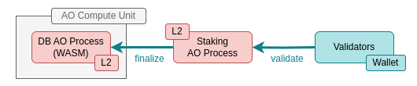

# WeaveDB Litepaper v0.2

- [Liepaper v0.1](../litepaper-v0_1/README.md)

## Hyper Scalable Autonomous zkDB with Cloud Performance

WeaveDB is the first fully decentralized NoSQL database with indefinite scalability and cloud-grade performance, built on a custom L3 rollup architecture that leverages L2 AO hyper-parallel computer and L1 Arweave permanent storage. It also supports seamless cross-chain querying through a novel zero-knowledge proof (ZKP) technology called zkJSON.

The economic sustainability of the databases is underpinned by a restaking mechanism similar to Eigenlayer. Rollup operators, data validators, and delegators are incentivized through rewards, while the databases themselves autonomously cover their operational costs. This novel design combines the principles of DePIN, restaking, and bonding curves, creating a self-sustaining ecosystem where liquidity yields offset infrastructure expenses. 

End users and dapps enjoy the same UX and performance as centralized web2 cloud databases, while developers benefit from an even superior developer experience due to the elimination of infrastructure management overhead. Once deployed, databases operate autonomously, requiring no manual intervention.

WeaveDB’s query APIs are highly compatible with the Firestore NoSQL database and extend beyond, offering a superset of capabilities tailored to cryptographic enhancements. This enables permissionless access and ensures full decentralization.

In the long run, the cost of using WeaveDB may significantly undercut traditional cloud services like AWS and GCP, especially with the future integration of [ArFleet](https://arfleet.io/), a highly economical temporary storage layer that leverages AO and Arweave’s verifiability for minimal operational costs.

At its core, WeaveDB is a general-purpose NoSQL database with endless use cases and applications. It is the only feasible solution for building fully decentralized, hyper-scalable applications on a global scale, such as a decentralized version of Twitter/X. WeaveDB paves the way for mass Web3 adoption, making scalability for billions of users achievable.

By adopting a modular architecture, WeaveDB enables the future development of additional database types, such as relational databases and vector databases, atop its core infrastructure. Once the JSON-based NoSQL implementation stabilizes, these possibilities will be actively explored.

## Architecture

This litepaper assumes readers are familiar with Arweave (L1) and AO (L2). Rather than covering their technical details of these two, it focuses on how WeaveDB achieves cloud-grade performance, indefinite scalability, full decentralization, and zero-knowledge proof-based interoperability with other blockchains.

### Prerequisite Knowledge

#### Arweave (L1)

[Arweave](https://arweave.org) is a blockchain protocol offering indefinite scalability and permanent data storage through a one-time upfront payment of $AR.

#### AO (L2)

[AO](https://ao.arweave.net) is a decentralized supercomputer built on top of Arweave. It offers indefinite scalability and horizontal performance using an asynchronous message communication protocol and an actor model. Unlike traditional blockchains, AO eliminates scalability bottlenecks caused by high computation and storage costs, making it the ideal foundation for fully decentralized databases.

### WeaveDB Rollup (L3)

While AO and Arweave provide a solid foundation, achieving cloud-grade performance and indefinite scalability requires overcoming specific limitations:

1. Memory Constraints:  
Each AO process runs as a WASM module, limiting on-chain storage to 16GB (WASM64). Though horizontal sharding across multiple processes is possible, it’s inefficient for databases.

2. High Latency:  
AO’s architecture divides message processing into three separate units, resulting in a 1–2 second latency per message. While AO can guarantee ACID properties at 1 TPS, this is insufficient for databases that require near-zero latency and high throughput (e.g., 100,000 TPS with ACID guarantees).

WeaveDB addresses these issues by operating as an L3 rollup on AO, ensuring full decentralization through Arweave’s data verifiability and a restaking-based batch validation mechanism.

### Cloud-Grade Performance

Achieving optimal database performance with ACID guarantees typically requires a single-server architecture with near-zero latency. Despite decentralization, WeaveDB maintains this performance by leveraging the verifiability of the parent layer, a design similar to how Ethereum L2 rollups operate.

Each WeaveDB instance functions as an L3 rollup node that processes queries at maximum speed, periodically bundles transactions, and commits them to an L2 rollup staking contract on AO. Validators then batch-verify these bundles, and the finalized queries are stored on AO. As a result, the database can be queried by end users and dApps directly on L3 or by other AO processes on L2.

This novel rollup design ensures cloud-grade performance with high throughput (TPS) on L3 databases and near-zero latency for off-chain applications. Additionally, on-chain AO processes can access data with only a few-second delay, overcoming the 1 TPS constraint and data inconsistency issues typical of AO-based databases when prioritizing high TPS over ACID compliance.

### Indefinite Scalability

Each AO process operates as a WASM module, which limits the on-chain storage to 4GB (WASM32) or 16GB (WASM64). Many AO applications face this limitation and resort to multi-process workarounds, which are far from optimal for scalable applications. WeaveDB addresses this critical bottleneck by introducing a novel architecture that enables AO processes to access any attested data stored on Arweave via an AO extension, bypassing the WASM memory limit.

This extension, a variant of [WeaveDrive](https://hackmd.io/@ao-docs/H1JK_WezR), allows read-only access to Arweave’s storage while efficiently computing current data states from rolled-up logs stored and finalized on Arweave. This approach ensures seamless scalability beyond the inherent WASM memory constraints.

The following is how queries are processed and how data is served to end-user applications and other AO processes.

1. An L3 rollup node processes DB queries at the maximum speed possible with the lowest latency with ACID.

2. The rollup node periodically yet instantly bundles queries into a message and commits it to the AO staking process. The logs are stored on Arweave.

3. Validators download the logs from Arweave and validate the rolled-up bundles are correct.

4. The staking process finalizes the bundles with a message to the AO database process.

5. The DB process has access to the data with an AO extension, which gets finalized logs from Arweave and efficiently computes and caches the current DB states in an underlying key-value store, and it could further utilize distributed cloud databases for horizontal scalability. This way, the scalability of the database is not constrained by the wasm memory limit.

6. Offchain applications can query data from the L3 rollup node with the lowest latency, while onchain AO processes can query data from the L2 DB process with a few second delay and slightly higher latency.

### Comparison with Traditional Databases

Modern high-performance databases often employ log-structured storage to achieve fast write operations. In a similar manner, WeaveDB leverages Arweave as log-structured storage and uses its rollup architecture to provide high-speed in-memory query performance. By utilizing the entire Arweave storage, WeaveDB eliminates the storage limitations of 4GB/16GB WASM memory, enabling AO processes to access an indefinite volume of data stored on Arweave/WeaveDB.

#### Log-Structured Storage Database Design

In traditional databases with log-structured storage, write queries are processed quickly by recording them in an in-memory MemTable and simultaneously appending them to a write-ahead log (WAL) on disk. The MemTable is periodically flushed to disk as SSTables, which serve as the persistent storage format. These SSTables are periodically compacted to reduce storage overhead and improve read efficiency. If the database crashes before the MemTable is flushed, it can recover its state by replaying the WAL, allowing modern databases to achieve high write throughput without frequent disk I/O.

#### WeaveDB Design

WeaveDB effectively uses Arweave as log-structured storage, while its rollup mechanism ensures optimal query performance by operating primarily in-memory. It solves three key bottlenecks that hinder AO-based and other decentralized databases:

- **1 - 3 Second Latency** :  
AO typically experiences 1 to 3 seconds of latency due to the multi-unit message processing architecture. In contrast, WeaveDB reduces latency to 10ms–200ms, depending on the proximity of the querying node.

- **4GB / 16GB Memory Limit** :  
The AO processes are constrained by WASM memory limits (4GB for WASM32, 16GB for WASM64). WeaveDB bypasses this limitation by storing logs externally on Arweave and effectively read and compute data via an AO extension (similar to WeaveDrive), enabling access to an unlimited amount of data.

- **1 TPS with ACID** :    
AO and most blockchains achieve fewer than 1 TPS when strict ACID guarantees are required due to high latency and slow transaction finality. WeaveDB currently supports up to 4,000 TPS with ACID guarantees per database instance, with future scalability targets ranging from 50,000 to 100,000 TPS.

### Zero Knowledge Provability

WeaveDB includes native support for zero-knowledge provability, enabling lightweight ZK proofs for querying data from any blockchain. This is achieved through zkJSON, a novel in-house technology, combined with nested sparse Merkle trees (SMTs), which represent the database structure. zkJSON efficiently encodes and proves data in JSON format, enabling fast proof generation and verification.

#### zkJSON

zkJSON combines three key components to enable efficient zero-knowledge proof generation:

1. Optimized JSON Encoding:  
JSON data is converted into a series of numbers using a highly efficient encoding scheme tailored for uint256 values, ensuring compatibility with EVM and zk circuits.

2. ZK-Optimized Circuits:  
Purpose-built zk circuits handle the encoded data efficiently without requiring full decoding during proof generation.

3. EVM Assembly Contracts:  
Specialized EVM assembly contracts allow direct navigation of encoded data, further enhancing performance and reducing computational overhead.

As a result, zkJSON can generate a ZK proof in under 3 seconds on a standard consumer laptop, allowing efficient querying of any WeaveDB data from EVM-compatible blockchains.

#### zkDB

WeaveDB represents its database structure using nested sparse Merkle trees (SMTs). These SMTs enable efficient proofs of data membership without revealing the entire dataset. By combining the SMT structure with zkJSON encoding, WeaveDB ensures verifiable, permissionless data querying while maintaining data integrity.

This is a typical NoSQL database structure.

zkDB (WeaveDB) represents the database structure with nested sparse merkle trees (SMTs) with zkp.

#### Optimistic zkRollup

WeaveDB functions as a zkRollup for database state transitions in relation to Ethereum and other blockchains. While it is capable of generating ZK proofs for state transitions, these are computationally expensive and rarely required in practice. Instead, AO and Arweave ensure data integrity using validator-based verification and restaking mechanisms.

Thus, WeaveDB operates as an optimistic zkRollup, leveraging AO’s [holographic state](https://medium.com/@perma_dao/consensus-holographic-state-4fe8a721abad) and Arweave’s permanent storage for finality. In other words, WeaveDB’s optimistic zkRollup architecture involves committing only the zk root hash of the top-level sparse Merkle tree (SMT), which is validated by the AO process.

Anyone can independently generate zkJSON proofs for querying WeaveDB from other blockchains. The proof generation is highly efficient, thanks to zkJSON’s novel encoding scheme and its specialized JSON-specific zk circuits, enabling lightweight and practical cross-chain queries.

Read more about zkJSON and zkDB in [this separate litepaper](https://github.com/weavedb/zkjson).

### $DB Tokenomics

WeaveDB employs a restaking mechanism on Ethereum and AO, inspired by EigenLayer, to secure rollup operations while ensuring database self-sustainability. Initially, rollups will be the first actively validated service, with plans to extend the same mechanism to other protocols, such as token bridges, zkRollups, and zkOracles, in the future.

#### Restaking Yield & $DB Airdrop

The WeaveDB protocol derives its primary value from restaking other tokens. Stakers can restake tokens like $stETH and $DAI to the AO staking contract or other approved tokens to the protocol-owned restaking contract. In return, WeaveDB accrues restaking yields and distributes $DB tokens as a reward to restakers through periodic airdrops.

The restaking yield is utilized to secure protocol-owned units (MU/SU/CU) responsible for the core rollup staking process on AO. Additionally, the $DB yield on the bonding curve liquidity of each database is dynamically adjusted based on this restaking yield and other factors, ensuring protocol-level security and sustainability.

#### Atomic Asset Bonding Curve Liquidity

When a database is deployed, it issues an [atomic asset](https://atomic-assets.arweave.dev/) with a [bonding curve](https://www.coinbase.com/learn/advanced-trading/what-is-a-bonding-curve). This atomic asset consists of [Universal Data License (UDL)](https://mirror.xyz/0x64eA438bd2784F2C52a9095Ec0F6158f847182d9/AjNBmiD4A4Sw-ouV9YtCO6RCq0uXXcGwVJMB5cdfbhE) and a fractional ownership token ($OWNER), while the bonding curve facilitates liquidity between $OWNER and $DB. The protocol distributes $DB yield to the liquidity pool proportional to the $DB amount, but instead of increasing liquidity, the yielded $DB is exclusively used to cover database query costs.

#### Database Cost and Profit Share

The $DB yield from liquidity is earned by validators and rollup operators. Validators must acquire $OWNER tokens and add liquidity between $OWNER and $DB to participate in the system. Delegators can delegate $DB to validators to enhance liquidity and, in return, receive a share of the validator rewards.

Rollup operators are required to stake a minimum amount of $DB in the bonding curve liquidity of each database they operate as a security deposit.

The protocol charges an Arweave storage fee along with a small percentage of the DB cost, which is deposited into the protocol endowment fund. Over time, this endowment builds stability in the $DB token’s value, ensuring long-term sustainability.

This novel design allows restaking liquidity yields to automatically cover infrastructure costs, effectively bootstrapping each database project. As long as a database maintains sufficient liquidity, no external party needs to bear the running costs. This approach incentivizes participants to increase both liquidity and database usage, creating a self-sustaining, decentralized infrastructure ecosystem.

#### Protocol Sustainability

The sustainability of WeaveDB’s protocol is underpinned by a carefully designed tokenomics model with multiple adjustable parameters. Its soundness is demonstrated through mathematical formulas and verified using a custom-built token simulator While the detailed mathematical models are presented in a separate paper, the high-level design principles are outlined below.

##### Player Incentivization

###### Rollup Operators

Rollup operators earn rewards for maintaining rollup operations. They can offer Database as a Service (DBaaS) with customizable extensions, including zero-knowledge proof (ZKP) functionalities, and charge arbitrary fees to uers, generating additional revenue streams.

###### Validators

Validators are rewarded for running lightweight validator nodes. To participate, validators must acquire $OWNER tokens from the bonding curve liquidity pool and provide a minimum liquidity amount in the $DB/$OWNER pair, which serves as a security deposit. This setup earns $DB yield for the database, and the more liquidity they contribute, the greater the rewards they receive. Validators can also collect $DB delegations from delegators, increasing their share of the total reward pool.

###### Delegators

Delegators can delegate their $DB tokens to validators and earn proportional rewards. This provides a low-effort way to earn $DB while reducing selling pressure by locking tokens, contributing to the long-term stability of the protocol.

###### DB Developers

Database developers are the original owners of $OWNER tokens when they deploy a new database. Instead of paying for operational costs, the database is bootstrapped with staking yields generated by the bonding curve liquidity. As validator and delegator participation increases, the value of $OWNER tokens is expected to rise. The protocol includes built-in incentives to support database/dApp developers.

###### DB Owners

Anyone can become a database owner by purchasing $OWNER tokens from the bonding curve liquidity (via a DEX). The value of $OWNER tokens is expected to appreciate as database usage grows.

###### DB Users

Database users—primarily web applications and other protocols—can access databases at minimal or zero cost, enjoying cloud-grade performance and indefinite scalability. Since data is permanently stored on Arweave, the database APIs remain accessible forever. Additionally, AO processes can provide API access directly, bypassing the need for a rollup operator in certain cases.

###### Restakers

Restakers earn $DB tokens by restaking external assets to the protocol. In exchange for their opportunity cost, $DB tokens are distributed proportional to their restaked amount. The protocol accrues yields from these restaked assets, which strengthens its sustainability. Restakers can also delegate their earned $DB tokens to validators, further compounding their rewards through validator incentives.
 
###### Investors

$DB token investors benefit from value accrual as database adoption increases. The tokenomics model is designed to ensure long-term sustainability through mathematically sound mechanisms and the integration of Protocol-Owned AI Agents (POAIAs). As a decentralized, general-purpose database, WeaveDB opens endless possibilities, from replacing Web2 applications to building novel blockchain protocols like autonomous zkOracles.

##### Key Protocol Parameters

Three primary parameters are continuously adjusted to maintain protocol sustainability.

###### Query Price

The query price is dynamically adjusted based on various factors, including $AR price, $DB price, and database usage.

###### $DB Staking APY

The $DB yield generated by the bonding curve liquidity covers database operational costs, including operator, validator, and delegator rewards. This yield rate is auto-adjusted according to overall protocol metrics.

###### Restaking APY

The restaking yield from external assets is dynamically adjusted based on protocol metrics and market conditions, including the price of restaked tokens.

##### Protocol-Owned AI Agents (POAIAs)

WeaveDB introduces the first-ever DeFi protocol with Protocol-Owned AI Agents (POAIAs), ensuring unbreakable tokenomics even under extreme conditions. These agents dynamically adjust protocol strategies in response to adversarial bots and market fluctuations. Powered by on-chain large language models (LLMs), POAIAs possess a unique advantage: they have superuser access to key protocol parameters, token supply control, and protocol-owned liquidity.

By leveraging their privileged access, POAIAs can outmaneuver external bots and malicious actors, maintaining equilibrium and stability. Beyond prevention, they also play an active role in value growth, continuously optimizing incentives for all participants based on real-time protocol statistics.

In essence, POAIAs represent a new era of autonomous finance (AgentFi), where decentralized protocols can self-regulate and evolve in response to constantly shifting environments. Full on-chain POAIAs are only achievable on AO, making WeaveDB a pioneer in this field.
